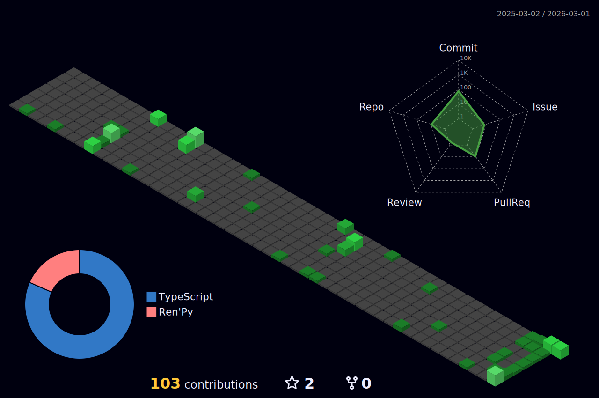

## 你好 👋

我是 34LiuNian，一个高中在读学生。我平时喜欢写一些有意思的小东西。

## 总览

  
更多信息…

  

## 项目

我创建的/我主要参与的项目：

待补充

## 开发

- 我主要使用的编程语言： 
  
  
  
- 我主要使用的框架： 
  
  
- 我主要使用的开发工具： 
  
  
  
  
  

## 与我联系

- 电子邮件：<@>
